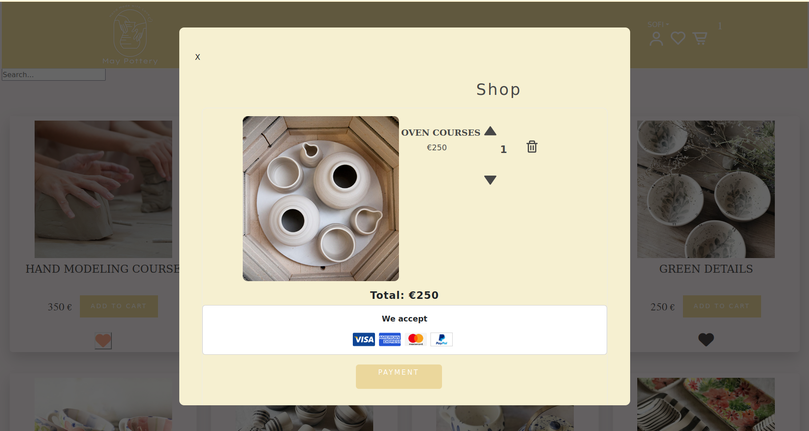

`#react-basics` `#assembler-institute-of-technology` `#master-in-software-engineering`
# REACT PROJECT ECOMMERCE

Putting into practice all the knowledge acquired so far, implementing them in an Ecommerce.
## General analysis
-Composed of a home, a products page, a shopping cart, a payment page and a wish list.

## Features

    HTML, CSS and JS.
    React

## Hooks

-UseState, useEffect, useContext, useReducer...

### Extra

    Private routes
    UseParams, UseNavigate

## Libraries

-React-router-dom, Create-react-app, React-hot-toast, React-bootstrap.
### Home Page

## WishList

### Product List

### Cart

### Login

### Payment Page

1. Advantages of using React

    React requires less code compared to other development platforms.
    Reusable components: This makes the application more scalable and easier to maintain as errors will occur in the component's own functionality or in its communication with the rest.
    Improves the user experience when navigating the web application, the speed at which pages load and facilitates the maintenance of the application.

## Authors

- [@SofiSit](https://github.com/SofiSit)

# Getting Started with Create React App

This project was bootstrapped with [Create React App](https://github.com/facebook/create-react-app).

## Available Scripts

In the project directory, you can run:

### `npm start`

### `json-server --watch src/data/db.json ---port 3001`

